# Visual Acuity Stimulus Engine
### Landolt C Optotype Renderer for Near-Eye Micro-Displays

---

## Overview

The **Visual Acuity Stimulus Engine (VASE)** is a Python-based clinical stimulus rendering system designed for head-mounted visual testing hardware. It generates **Landolt C optotypes** at precise, physics-correct sizes using visual-angle geometry — with no hardcoded pixel values.

The system is purpose-built for a near-eye micro-display at an optical distance of **100 mm**, simulating the environment of a wearable vision testing device.

---

## System Specifications

| Parameter | Value |
|:---|:---|
| Optical viewing distance | 100 mm |
| Display PPI | 300 |
| Output resolution | 800 × 600 px |
| Rendering library | OpenCV (cv2) |
| Language | Python 3.8+ |

---

## Visual Angle Calculation Pipeline

All stimulus sizes are derived mathematically — no pixel values are hardcoded.

**Step 1 — Arc minutes → Radians**
```
θ (rad) = arcmin × π / (180 × 60)
```

**Step 2 — Visual angle → Physical size (mm)**
```
gap (mm) = d × tan(θ)          [d = 100 mm]
```
> Full `tan(θ)` is used rather than the small-angle approximation for maximum accuracy.

**Step 3 — Physical size → Pixels**
```
pixels = mm × (PPI / 25.4)     [PPI = 300]
```

**Step 4 — Optotype proportions (1:5 standard)**
```
Total height = 5 × gap
Stroke width = 1 × gap
```

### Calculated Sizes at 100 mm / 300 PPI

| Acuity | Gap Angle | Gap (mm) | Gap (px) | Height (px) | Rendered |
|:-------|:----------|:---------|:---------|:------------|:---------|
| 6/6    | 1 arcmin  | 0.0291   | 0.34     | 1.72        | ⚠ Clamped |
| 6/12   | 2 arcmin  | 0.0582   | 0.69     | 3.44        | ⚠ Clamped |
| 6/18   | 3 arcmin  | 0.0873   | 1.03     | 5.15        | Natural |
| 6/60   | 10 arcmin | 0.2909   | 3.44     | 17.18       | Natural |

> [!WARNING]
> **Clamped levels** (6/6 and 6/12) fall below the 2 px hardware floor at this display/distance combination. They are rendered at minimum visible size and a console warning is printed. This is physically correct behaviour — not a bug.

---

## System Architecture

### Component Overview

```mermaid
graph TB
    subgraph INPUT["Input Layer (main.py)"]
        KB["Keyboard — cv2.waitKeyEx()"]
        KB -->|"1-4"| ACU["Acuity Selector"]
        KB -->|"W/A/S/D / Arrows"| RESP["Response Handler"]
        KB -->|"M / T / F / H"| TOGGLE["Mode Toggles\n(Adaptive · Theme · Fullscreen · HUD)"]
    end

    subgraph STATE["State Manager (main.py)"]
        ACU --> SM["current_acuity_key\ncurrent_orientation\nadaptive_mode\ndark_mode\nfullscreen\nhide_hud"]
        TOGGLE --> SM
    end

    subgraph ADAPTIVE["Adaptive Protocol (main.py)"]
        RESP -->|"submit direction"| EVAL["Evaluate Response\n(Correct / Incorrect)"]
        EVAL -->|"Correct → step harder"| STEP["step_acuity()"]
        EVAL -->|"Incorrect → step easier"| STEP
        STEP --> SM
    end

    subgraph ENGINE["VisualAcuityEngine (visual_acuity_engine.py)"]
        SM -->|"acuity_key + orientation + modes"| MATH

        subgraph MATH["Math Pipeline"]
            A1["arcmin_to_rad()\nθ = arcmin × π / 10800"]
            A2["visual_angle_to_mm()\ngap = d × tan(θ)"]
            A3["mm_to_pixels()\npx = mm × PPI / 25.4"]
            A4["calculate_sizes_px()\nheight = 5 × gap"]
            A1 --> A2 --> A3 --> A4
        end

        subgraph CONSTRAINTS["Constraint Handling"]
            C1{"height > screen?"}
            C2{"height < 2px?"}
            C1 -->|"Yes → scale down"| WARN1["⚠ Console Warning"]
            C2 -->|"Yes → clamp to min"| WARN2["⚠ Console Warning"]
        end

        subgraph RENDER["OpenCV Renderer"]
            R1["np.zeros / np.full\n(black or white canvas)"]
            R2["cv2.circle × 2\n(outer ring + inner hole)"]
            R3["cv2.fillPoly\n(gap rectangle, rotated)"]
            R4["cv2.putText\n(HUD labels)"]
            R1 --> R2 --> R3 --> R4
        end

        MATH --> CONSTRAINTS --> RENDER
    end

    subgraph OUTPUT["Output Layer"]
        RENDER -->|"canvas (numpy array)"| DISP["cv2.imshow()\n800×600 window"]
        EVAL -->|"per trial"| CSV["acuity_logs.csv\nTimestamp · Acuity · Orientation\nResponse · Result · Mode"]
    end
```



### Simple Flow

```mermaid
flowchart TD
    KB(["⌨ Keyboard Input"])

    KB -->|"1 / 2 / 3 / 4"| ACU["Acuity Level Switch"]
    KB -->|"M / T / F / H"| MOD["Mode Toggles"]
    KB -->|"W A S D / Arrow Keys"| RESP["Submit Response"]

    RESP --> EVAL{"Correct?"}
    EVAL -->|"Yes"| HARDER["Step Harder"]
    EVAL -->|"No"| EASIER["Step Easier"]
    HARDER --> ENGINE
    EASIER --> ENGINE
    ACU --> ENGINE
    MOD --> ENGINE

    ENGINE["VisualAcuityEngine"]
    ENGINE --> MATH["Math Pipeline\narcmin → rad → mm → px"]
    MATH --> CHK{"Size OK?"}
    CHK -->|"Too large"| SCALE["Scale down proportionally"]
    CHK -->|"Too small (< 2px)"| CLAMP["Clamp to minimum"]
    CHK -->|"OK"| DRAW
    SCALE --> DRAW
    CLAMP --> DRAW

    DRAW["OpenCV Render\nLandolt C + HUD"]
    DRAW --> WIN(["🖥 cv2.imshow()"])
    EVAL -->|"Log trial"| LOG(["📄 acuity_logs.csv"])
```



### Design Principles

1. **Physical accuracy** — no hardcoded pixel values; all dimensions flow from `PPI` and `viewing_distance_mm`
2. **Separation of concerns** — `VisualAcuityEngine` owns math and rendering; `main.py` owns interaction and I/O
3. **Safety-first** — display constraint violations emit console warnings and clamp gracefully
4. **Extensibility** — engine accepts any PPI/distance at construction; supports multiple display profiles

---

## Installation

**1. Clone the repository**
```bash
git clone https://github.com/Dheerajvarma1/Visual-Acuity-Engine.git
```

**2. Create and activate environment**
```bash
pip install -r requirements.txt
```

**3. Run**
```bash
python main.py
```

---

## Controls

### Acuity Level Selection
| Key | Acuity | Gap Angle |
|:----|:-------|:----------|
| `1` | 6/6    | 1 arcmin  |
| `2` | 6/12   | 2 arcmin  |
| `3` | 6/18   | 3 arcmin  |
| `4` | 6/60   | 10 arcmin |

### Response Input
| Key | Direction |
|:----|:----------|
| `W` or `↑` | Up    |
| `S` or `↓` | Down  |
| `A` or `←` | Left  |
| `D` or `→` | Right |

### System Controls
| Key | Action |
|:----|:-------|
| `M` | Toggle Adaptive Mode ON / OFF |
| `T` | Toggle Dark / Light theme |
| `F` | Toggle Fullscreen / Windowed |
| `H` | Hide / Show HUD labels |
| `ESC` | Exit |

---

## Features

### Core
- **Physics-correct rendering** — all sizes derived from PPI, viewing distance, and visual angle
- **Anti-aliased Landolt C** — smooth stimulus at all sizes using `cv2.LINE_AA`
- **4 acuity levels** — 6/6 through 6/60 (1–10 arcmin gap)
- **4 gap orientations** — Up, Down, Left, Right (randomised per trial)
- **Display constraint handling** — scale-down if stimulus exceeds screen; 2 px floor with console warning if too small

### Bonus Features
- **Adaptive acuity** — correct response steps to a harder level; incorrect steps easier, converging toward the user's acuity threshold
- **Randomised presentation** — orientation randomised on every trial and acuity switch
- **Dark / Light theme** — switchable on-the-fly with `T`
- **Fullscreen mode** — toggle with `F`
- **HUD hide** — press `H` for a clean stimulus-only view (useful for recording)

---

## Response Logging

All responses are automatically appended to `acuity_logs.csv`:

| Column | Description |
|:-------|:------------|
| `Timestamp` | ISO datetime of the trial |
| `Acuity Level` | e.g. `6/6` |
| `True Orientation` | Ground-truth gap direction |
| `User Response` | Submitted direction |
| `Result` | `Correct` / `Incorrect` |
| `Mode` | `Adaptive` / `Manual` |

### Sample Output

| Timestamp | Acuity Level | True Orientation | User Response | Result | Mode |
|:---|:---|:---|:---|:---|:---|
| 2026-02-20 03:17:16 | 6/6 | Left | Left | Correct | Adaptive |
| 2026-02-20 03:17:16 | 6/6 | Up | Up | Correct | Adaptive |
| 2026-02-20 03:17:17 | 6/6 | Up | Up | Correct | Adaptive |
| 2026-02-20 03:17:17 | 6/6 | Left | Left | Correct | Adaptive |
| 2026-02-20 03:17:18 | 6/6 | Right | Right | Correct | Adaptive |

---

## Project Structure

```
Visual-Acuity-Engine/
├── visual_acuity_engine.py   # Core engine: math, rendering, constraint handling
├── main.py                   # Application loop, input handling, CSV logging
├── explanation.md            # Technical write-up: math, assumptions, pixel table
├── acuity_logs.csv           # Auto-generated trial log
├── requirements.txt          # Python dependencies
└── README.md                 # This file
```

---

## Design Decisions

| Decision | Rationale |
|:---------|:----------|
| `tan(θ)` over small-angle approximation | More accurate; negligible performance cost |
| 2 px minimum height floor | Spec requirement; anything smaller is a single aliased pixel |
| Stroke = gap width | Standard clinical Landolt C proportions (1:5 ratio) |
| `cv2.waitKeyEx()` | Required for reliable extended key (arrow) detection on Windows |
| Modular engine class | Decouples rendering maths from application logic for reusability |
| **Central Rendering** | Stimulus is rendered at `(width/2, height/2)`, satisfying the "central region only" requirement for near-eye displays |

---

## Potential System Questions

**What happens if viewing distance changes?**
Pass a new `viewing_distance_mm` to `VisualAcuityEngine`. All sizes recalculate automatically — no other changes needed.

**How would you calibrate for a real device?**
Measure the physical display PPI with a test pattern, verify the optical path length, and update those two constructor parameters. The rest of the pipeline is invariant.

**How would you support different displays?**
`VisualAcuityEngine` accepts `display_ppi` and `resolution` as constructor arguments. Each display profile can be instantiated independently.

---

## Dependencies

```
opencv-python
numpy
```

Install via:
```bash
pip install -r requirements.txt
```
